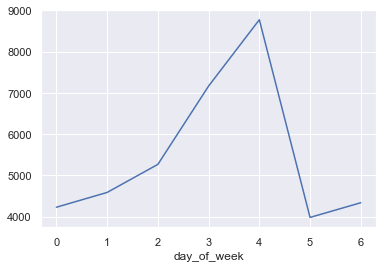
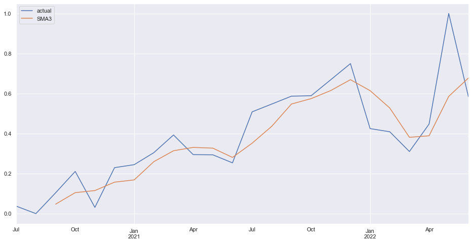

# Hyper-star-time-series

Data, data and, data. Something that can be found everywhere, but what data is, and why it is a hot subject these days? Data, in summary, is information, information gathered by different sections of a company or different people in an organization, and the reason it is a hot subject these days is, businesses are using it to get insights about their performance in various fields. However, data by itself cannot do anything to keep a business afloat; it should be processed and analyzed in order to become suitable for reporting. Anyway, in this repo I want to share my insights derived from Hyper Star’s stores dataset. In this repo, you can have access to 4 notebooks and their details to see how I reached to some results.

### in this repo you can find the answers to 4 questions

1. What is the biggest increase rate in sales in different stores on the weekend?

2. Forecasting sales for the next month using ARIMA and SMA.

3. How to prepare our data for forecasting? 

for the first question you can check out this notebook [1.weekend purchase.ipynb](https://github.com/SajjadParizan/Hyper-star-time-series/blob/main/notebooks/1.%20weekend%20purchase.ipynb)

to see how I modeled the sale behavior you can check out this notebook [2.modeling.ipynb](https://github.com/SajjadParizan/Hyper-star-time-series/blob/main/notebooks/2.%20modeling.ipynb)

and finally to see the pipeline preparation you can check out this notebook [3 pipeline for preparing data.ipynb](https://github.com/SajjadParizan/Hyper-star-time-series/blob/main/notebooks/3%20pipeline%20for%20preparing%20data.ipynb)
